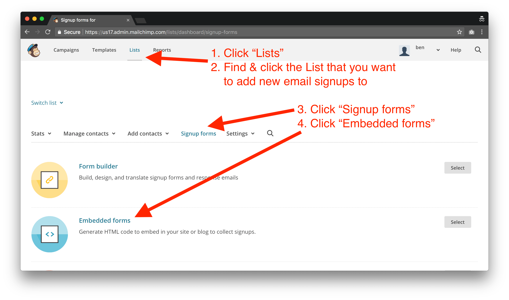
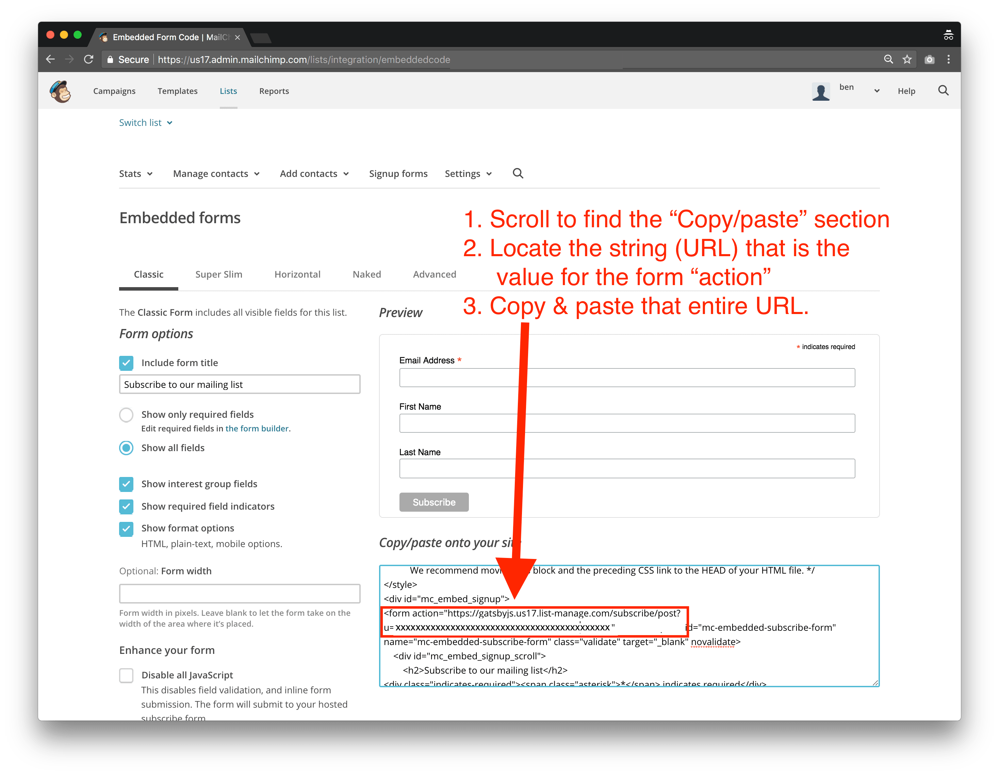

This Gatsby plugin helps you add email addresses to your Mailchimp list much easier than re-writing the code yourself.  Mailchimp makes it difficult to add emails to lists from the client -- they say it could lead to spam (which is true but from what Iʼve seen, very rare occurance).  I've extrapolated all the messy logic into one nice, neat, lightweight plugin!

### Features
This plugin accepts your Mailchimp account and list settings via your `gatsby-config` file and allows you to pass in an email address and any additional attributes you'd like to save with the user.

For success and error messages, we simply forward whatever is returned from Mailchimp.


### Get Started
Youʼll first have to add your Mailchimp account and list settings to your `gatsby-config.js` file.  Next, youʼll have to import this plugin into each file youʼd like to use it with.  Detailed instructions below.

In your terminal, type:
`$ yarn add gatsby-plugin-mailchimp`

Then in your `gatsby-config.js` file, add the following code to the plugin section:

```javascript
 plugins: [
    ...
    {
      resolve: 'gatsby-plugin-my-cool-plugin',
      options: {
        endpoint: '', // see `Gatsby Config Instructions` section below
      },
    },
```

Next, navigate to the file where you collect email addresses (ie, the file you want to import this plugin into).  Add the following code:

```javascript
import addToMailchimp from 'gatsby-plugin-mailchimp'

...

export default MyGatsbyComponent extends React.Component {
  _handleSubmit = (email, listFields) = {
    addToMailchimp(email, listFields)
  }

  render () {
    return (
      <form onSubmit={_handleSubmit(email, {listFields})}>
        ...
      </form>
    )
  }
}
```

NOTE: for the `email` field, pass in the email as normal (ie, _you@gmail.com_); do _not_ encode or transform the email, our plugin will do that for you!

If you are using React controlled form fields, then the listFields is something you can simply pull from state and pass to the plugin.  Examples include user's first/last name, contact info, and sometimes I even like to collect the page pathname the user is on so I know which page gets the most signups.

Also what I like to do is have React state handle the success or error message.  This allows me to display a dialogue to a user.

For example: TODO: link to Gatsby website of where this plugin is used.


### Gatsby Config Instructions

You need to provide this plugin with your Mailchimp account and list details in order for it to know which endpoint to save the email address to.  Follow these directions:

1. Login to your Mailchimp account
2. Click "Lists" tab at the top
3. Locate the Mailchimp list you want to save email addresses to
4. Click the list
5. Click the subtab "Signup forms
6. Click "Embedded forms"



7. Scroll down to the section with all the HTML code
8. Locate the HTML form element.  Copy the entire URL listed under the form "action" attribute
9. Paste that URL into your `gatsby-config`ʼs `option.endpoint` field



... that's all!

### To do
- MC is returning a random error yet it still adds the user to the MC email list
- ensure MC endpoint is valid
- create basic MC field form (name, email, submit button)
- fix `src/index.js` to use `async/await`

